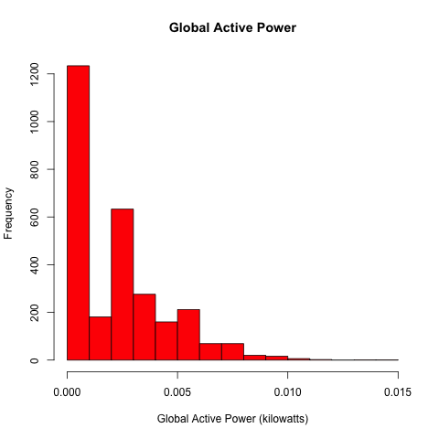
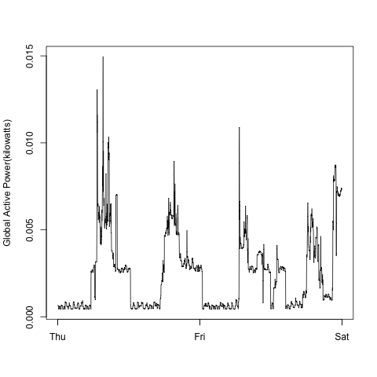
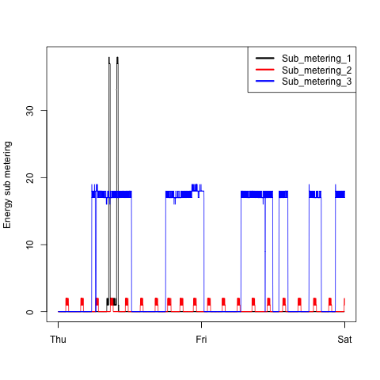
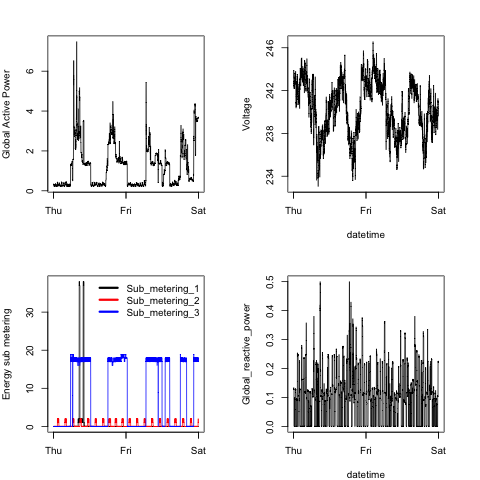

## Course Project 1
This repo contains my work for the first project in the Coursera Exploratory Data Analysis course, which is one of the tracks in the Johns Hopkins Data Science Certificate program.

Four R scripts are contained in the repo, each of which correspond to the four PNG files created when the scripts are executed. 

Each script presumes the data specified in the assignment is located in a directory relative to execution:

  datafile="../data/household_power_consumption.txt"

A different pathname can be used by modyfing that string in each of the script.  Alternatively, simply modify the evocation of the function created in each scrpt to use a different value, such as:  

     plot1(datafile="some/new/path")

This default path should be changed if you plan to use the functions on your own system.  

The R files in the repo produced the associated png images, which are also in this repo.  The png images appear to me to be identical to those included in the assignment instructions.

## A Note on Configuration

A number of functions in this assignment are dependent on the <a href="http://cran.r-project.org/web/packages/rJava/index.html">rJava package</a> in order to execute. Successfully installing that package proved to be more problematic than anticipated.  After some experimentation I did finally manage to succeed in loading the library on my Mac, but not without some changes.

My configuration for this assignment:

    - Mac Mini x64
    - OSX Yosemite Version 10.10.2
    - RStudio Version 0.98.1091  
    - R version 3.1.2 (2014-10-31) -- "Pumpkin Helmet"
    

Failure to load the rJava library prevented loading of data.table and related fuctions.  I was finally successful by including the followinging lines in my .bash_profile:

    export JAVA_HOME=/System/Library/Java/JavaVirtualMachine/jdi1.6.0.jdk/Contents/Home/
    
    alias rstudio='LDLIBRARY=$JAVA_HOME/jre/lib/server: open -a Rstudio'
    

The current version of rJava evidently has hard dependencies on Java 6, which was the default on my Mac initially.  Java 7 and Java 8 updates to my jdk were evidently the issue.  

From what I have read, similar issues arise on Windows systems, but I have not tackled that problem.

## Images Produced 

The following images were produced by the associated functions included in this repo:
### Plot 1

 

### Plot 2

 

### Plot 3

 

### Plot 4

 

The original instructions for the assignment follow.

## Introduction

This assignment uses data from
the <a href="http://archive.ics.uci.edu/ml/">UC Irvine Machine
Learning Repository</a>, a popular repository for machine learning
datasets. In particular, we will be using the "Individual household
electric power consumption Data Set" which I have made available on
the course web site:

* <b>Dataset</b>: <a href="https://d396qusza40orc.cloudfront.net/exdata%2Fdata%2Fhousehold_power_consumption.zip">Electric power consumption</a> [20Mb]

* <b>Description</b>: Measurements of electric power consumption in
one household with a one-minute sampling rate over a period of almost
4 years. Different electrical quantities and some sub-metering values
are available.

The following descriptions of the 9 variables in the dataset are taken
from
the <a href="https://archive.ics.uci.edu/ml/datasets/Individual+household+electric+power+consumption">UCI
web site</a>:

<ol>
<li><b>Date</b>: Date in format dd/mm/yyyy </li>
<li><b>Time</b>: time in format hh:mm:ss </li>
<li><b>Global_active_power</b>: household global minute-averaged active power (in kilowatt) </li>
<li><b>Global_reactive_power</b>: household global minute-averaged reactive power (in kilowatt) </li>
<li><b>Voltage</b>: minute-averaged voltage (in volt) </li>
<li><b>Global_intensity</b>: household global minute-averaged current intensity (in ampere) </li>
<li><b>Sub_metering_1</b>: energy sub-metering No. 1 (in watt-hour of active energy). It corresponds to the kitchen, containing mainly a dishwasher, an oven and a microwave (hot plates are not electric but gas powered). </li>
<li><b>Sub_metering_2</b>: energy sub-metering No. 2 (in watt-hour of active energy). It corresponds to the laundry room, containing a washing-machine, a tumble-drier, a refrigerator and a light. </li>
<li><b>Sub_metering_3</b>: energy sub-metering No. 3 (in watt-hour of active energy). It corresponds to an electric water-heater and an air-conditioner.</li>
</ol>

## Loading the data

When loading the dataset into R, please consider the following:

* The dataset has 2,075,259 rows and 9 columns. First
calculate a rough estimate of how much memory the dataset will require
in memory before reading into R. Make sure your computer has enough
memory (most modern computers should be fine).

* We will only be using data from the dates 2007-02-01 and
2007-02-02. One alternative is to read the data from just those dates
rather than reading in the entire dataset and subsetting to those
dates.

* You may find it useful to convert the Date and Time variables to
Date/Time classes in R using the `strptime()` and `as.Date()`
functions.

* Note that in this dataset missing values are coded as `?`.

## Making Plots

Our overall goal here is simply to examine how household energy usage
varies over a 2-day period in February, 2007. Your task is to
reconstruct the following plots below, all of which were constructed
using the base plotting system.

First you will need to fork and clone the following GitHub repository:
[https://github.com/rdpeng/ExData_Plotting1](https://github.com/rdpeng/ExData_Plotting1)

For each plot you should

* Construct the plot and save it to a PNG file with a width of 480
pixels and a height of 480 pixels.

* Name each of the plot files as `plot1.png`, `plot2.png`, etc.

* Create a separate R code file (`plot1.R`, `plot2.R`, etc.) that
constructs the corresponding plot, i.e. code in `plot1.R` constructs
the `plot1.png` plot. Your code file **should include code for reading
the data** so that the plot can be fully reproduced. You should also
include the code that creates the PNG file.

* Add the PNG file and R code file to your git repository

When you are finished with the assignment, push your git repository to
GitHub so that the GitHub version of your repository is up to
date. There should be four PNG files and four R code files.

The four plots that you will need to construct are shown below. 

### Plot 1

 

### Plot 2

 

### Plot 3

 

### Plot 4

 

